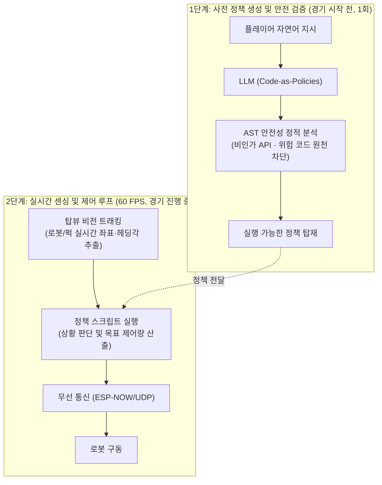

# Proposal: 프롬프트 봇 아레나 (PromptBot Arena)

### 프롬프트만으로 로봇에게 지시하여 게임을 단계별로 공략하는 아레나

- **제출일**: 2026년 9월 21일 (월)

- **제출자**: 박수민 (학번: 20240328)

## 1. Motivation (연구 배경 및 미충족 수요)

### 1.1 시장 및 학계 현황 (Current Landscape)

인공지능(AI) 시대의 핵심 역량은 특정 기술의 숙련도가 아닌, **자신의 아이디어를 명료화하여 AI에게 올바른 의사결정 기준을 전달하는 능력이다.** 이는 곧 복합적인 상황 속에서 **목표와 우선순위, 제약 조건을 체계적으로 정의해 AI를 주도적으로 제어하는 고차원 프롬프팅 역량을 의미한다.**

현재 교육 현장과 학계의 논의를 살펴보면 크게 두 가지 측면에서 명확한 교육적 공백과 방법론적 한계가 존재한다:

1.  **코딩 교육의 보급과 '명세(Specification)' 교육의 부재**:

    - 기존 소프트웨어 교육은 컴퓨터 언어나 블록코딩으로 문제의 실행 절차를 직접 설계하는 '구현(Implementation) 역량'을 함양하는 데 집중해 왔으며, 이는 컴퓨팅 사고력의 기초로서 여전히 유의미하고 필수적인 교육이다.

    - 그러나 생성형 AI가 인간의 구현 과정을 상당 부분 보조하는 오늘날에는, "어떻게 한 줄씩 구현할 것인가"와 별개로 **"인간이 무엇을 원하고, 어떤 기준과 제약 속에서 AI가 동작해야 하는가"를 체계적으로 규정하는 '명세(Specification) 역량'이 완전히 독립된 필수 교육 영역으로 분화되었다.** 기존 코딩 교육만으로는 이러한 고차원적 프롬프트 엔지니어링 역량을 함양하기 어렵다.

2.  **프롬프트 엔지니어링 교육 방법론의 현실적 한계와 정체**:

    - 프롬프트 엔지니어링의 중요성이 대두되었음에도 불구하고, 이를 실질적으로 체득시키는 교육 방법은 여전히 매우 초보적인 수준에 머물러 있다.

    - **Prompt Machine (Aalborg Univ., 2024)**: 물리적 큐브를 활용해 생성형 AI와 상호작용하는 선구적 시도를 보여주었으나, 문체 변환이나 텍스트 재작성 수준에 머물러 있다. 이는 목표·우선순위·예외 조건 같은 엄밀한 프롬프트 엔지니어링을 훈련한다기보다는 "AI가 이렇게 동작한다"는 원리를 입문 수준에서 시각화하는 데 그친다.

    - **Prompto (Univ. of Birmingham, 2024)**: 프롬프트 엔지니어링 교육의 필요성을 본격적으로 다루며 카드 기반 게이미피케이션을 도입했으나, 실제 운영 구조는  
      과제 카드 제시 → 참가자가 상용 모델에 프롬프트 입력 → AI 텍스트 결과 확인 → 참가자 간 상호 평가 → 수정 및 재실행  
      이라는 정적인 텍스트 루프에 머물러 있다. 카드는 과제 제시용일 뿐 프롬프팅 자체는 여전히 화면 속 텍스트 타이핑에 의존하며, 학습 대상이 성인 및 교육자에 치중되어 있고, 참가자의 주관적 평가에 의존하여 즉각적이고 Dynamic한 피드백을 제공하지 못한다.

### 1.2 핵심 문제 정의 및 Unmet Needs

- **타깃 사용자**: 초등 중·고학년 ~ 중학생

- **Core Question**: *"모호한 생각을 명료한 기준과 제약 조건으로 구조화하는 AI 프롬프팅 역량을 어떻게 스크린을 벗어나 물리 세계에서 체득시킬 것인가?"*

- **Unmet Need**:

  - 기존 소프트웨어 교육에서는 화면 속 개념을 직관적으로 체득시키기 위해 피지컬 교구(햄스터봇, 레고 등)가 효과적으로 활용되어 왔다.

  - 반면, 프롬프트 엔지니어링 교육은 여전히 텍스트 입출력 화면에 머물러 있어, 학습자가 자신의 지시(목표, 우선순위, 예외 조건)가 초래한 논리적 결함을 물리적 결과로 직접 확인하고 개선할 수 있는 '실물 기반 프롬프팅 교구 플랫폼'이 부재하다.

## 2. Objectives (연구 목표 및 정량적 평가 지표)

### 2.1 최종 개발 목표

본 연구의 최종 목표는 책상 위 경기장에 배치된 실물 로봇 두 대와 컴퓨터가 유기적으로 연동되는 환경에서, 플레이어가 오직 자연어 프롬프트만으로 로봇에게 지시를 내려 상대 로봇을 단계별로 공략하는 '프롬프트 봇 아레나(PromptBot Arena)'를 구축하는 것이다.

- **플레이 및 상호작용 흐름**:

  - 경기장 상단의 센서와 두 대의 로봇이 컴퓨터와 실시간으로 연결된다.

  - 플레이어가 컴퓨터에 일상적인 자연어로 작전 지시(프롬프트)를 입력하면, AI가 그 의도를 해석하여 로봇의 정책을 마련하고 즉시 경기를 진행한다.

  - 상대 로봇과의 대결에서 승리하면 다음 난이도 단계로 넘어가며, 단계가 올라갈수록 상대 로봇은 점차 지능적이고 까다로운 전술을 구사한다.

  - 플레이어는 실물 로봇의 물리적 결과를 관찰하며 자연스럽게 지시를 구체화하고 다듬어 나간다.

- **사용자 경험 예시 (1:1 로봇 축구 게임)**:

| **구분** | **초기 프롬프트** | **로봇의 물리적 실패** | **개선된 프롬프트** |
|----|----|----|----|
| **단계 간 프롬프트 개선** *(상대 전술 극복)* | *"공으로 달려가 골을 넣어라."* | 길목을 막아선 2단계 보스와 충돌해 공을 뺏김 | *"공으로 가되, **상대가 길을 막으면 빈 공간으로 돌아서** 가라."* |
| **단계 내 프롬프트 개선** *(모호한 표현 디버깅)* | *"공이 다가오면 밖으로 걷어내라."* | 아군 골대 바로 옆으로 공을 쳐내 코너킥 위기 초래 | *"우리 골대 쪽 말고, **상대 진영 쪽 사이드로** 걷어내라."* |

### 2.2 정량적·측정 가능 목표 (Quantitative & Measurable Goals)

본 프로젝트는 시스템의 실시간 반응성과 안정적인 경기 운영을 검증하기 위해 다음과 같은 객관적 지표를 목표로 설정한다:

| 구분 | 평가 항목 | 목표 수치 | 검증 방법 |
|:---|:---|:---|:---|
| **실시간 센싱·제어** | 비전 트래킹 및 무선 제어 루프 레이턴시 | • 비전 처리 20 ms 이하 (60 FPS)<br>• 무선 RTT 10 ms 이하 (손실률 0.5% 이하) | 웹캠 프레임 캡처부터 5개 객체 좌표 추출 및 로봇 무선 제어 패킷 송수신 RTT 로그 측정 |
| **LLM 파이프라인** | 정책 코드 변환 지연 및 구문 안전성 | • 변환 지연 5.0초 이하<br>• 비인가 API 차단율 100% | 사용자 입력 후 스크립트 파싱 시간 측정 및 30회 테스트 셋 대상 AST 정적 분석 검증 |
| **경기 구동 안정성** | 60초 배틀 무중단 완주율 | 95% 이상 | 30회 경기 진행 중 프로세스 비정상 종료(Crash)나 로봇 간/벽면 교착(Deadlock) 없이 정상 완주한 비율 측정 |
| **게임 룰 자동 판정** | 비전 기반 승패 및 구역 판정 정확도 | 100% | 30회 경기 종료 시점 승패 판정 결과와 실제 물리 상태의 일치율 검증 |

## 3. Innovation (혁신성 및 선행 연구 대비 차별점)

### 3.1 선행 연구 현황 및 본 프로젝트의 의의

- **Google Research 'Code as Policies' (Liang et al., 2023)**:

  - 자연어 지시를 실행 가능한 Python 정책 코드로 변환하는 패러다임을 확립한 본 연구의 이론적 근간이다.

  - **본 프로젝트의 의의**: 고가·고성능 연구 인프라에 국한되던 CaP 프레임워크를 '교육용의 저비용 2륜 로봇' 규격으로 경량화하여, 교육 현장에 도입 가능한 실시간 피지컬 테스트베드로 확장 응용한다.

- **Aalborg Univ 'Prompt Machine' (Jacobsen et al., 2024)**:

  - 물리 큐브 블록을 조립해 프롬프트를 입력하고 AI 결과를 종이로 출력하는 선행 피지컬 교구 연구이다.

  - **차별점**: Prompt Machine은 AI의 기초 원리를 시각화하는 입문 도구에 머물러 있다. 본 프로젝트는 프롬프트의 최종 산출물을 '실물 로봇의 물리적 공간 선점, 동적 궤적 설계, 실시간 승패'로 실체화하여 목표 및 제약 조건 중심의 고차원 사고력 훈련을 가능하게 한다.

- **Univ of Birmingham 'Prompto' (Gibson et al., 2024)**:

  - 과제 카드를 제시하고 참가자들이 프롬프트를 작성·평가하는 카드 게임 기반 교육 선행 연구이다.

  - **차별점**: Prompto는 성인 중심의 정적인 화면 텍스트 작업 및 주관적 동료 평가에 머물러 있다. 본 프로젝트는 초·중등 학습자를 대상으로 '1~10단계 적응형 상대 보스'라는 명확하고 역동적인 물리적 대결을 제공하여, 프롬프트의 완성도를 객관적인 승패 결과로 즉각 검증하고 디버깅하도록 한다.

### 3.2 핵심 차별화 요소

1.  **No-Coding Mental Model**: 코딩 구문 오류 디버깅에 소모되는 인지 부하를 없애고, 'AI 지시·제어 사고력'에 온전히 집중한다.

2.  **Dynamic Physical Feedback Loop**: 프롬프트의 결과가 텍스트나 주관적 평가가 아닌 '실물 로봇의 물리적 상호작용 및 승패'로 즉각 발현되어 빠른 가설 검증 사이클을 제공한다.

3.  **1~10단계 적응형 지능 보스 (PvE)**: 단순 수치 조정이 아닌, 기하학적·전술적으로 고도화되는 상대 에이전트를 공략하기 위해 플레이어가 점진적으로 세부 조건과 예외를 구체화하도록 유도한다.

## 4. Methods (시스템 아키텍처 및 구현 방법론)

본 시스템은 크게 (1) 데스크톱 경기장 및 구동 하드웨어, (2) Code-as-Policies 소프트웨어 파이프라인, (3) 3종 실시간 배틀 모드로 구성된다.



```text
[ 1단계: 사전 정책 생성 및 안전 검증 (경기 시작 전, 1회) ]
플레이어 자연어 지시 ──► LLM (Code-as-Policies) ──► AST 안전성 정적 분석 ──► 실행 가능한 정책 탑재
                                                      (비인가 API·위험 코드 원천 차단)
  │
  ▼
[ 2단계: 실시간 센싱 및 제어 루프 (60 FPS, 경기 진행 중) ]
┌── 탑뷰 비전 트래킹 (로봇/퍽 실시간 좌표·헤딩각 추출)
│    ▼
└── 정책 스크립트 실행 (상황 판단 및 목표 제어량 산출) ──► 무선 통신(ESP-NOW/UDP) ──► 로봇 구동
```

### 4.1 데스크톱 경기장 및 비전 트래킹 (Hardware & Vision)

- **경기장 환경**:

  - 책상 위에 배치 가능한 크기의 사각형 평면 경기장이다.

  - 로봇과 퍽의 이탈을 막는 적당한 높이의 외벽으로 둘러싸여 있으며, 상단에 경기장 전체를 조감하는 탑뷰(Top-down) 웹캠 1대를 거치하여 전장을 실시간 모니터링한다.

- **RGB LED 기반 능동 발광 식별 체계**:

  - 복잡한 광학 필터 없이 일반 웹캠과 HSV 색상 추출만으로 객체를 빠르고 명확하게 분리하기 위해, 로봇 및 오브젝트 상단에 직관적인 색상의 고휘도 LED를 배치한다.

  - **내 로봇 (Player)**: **빨강(전방) / 분홍(후방)** 투톤 LED 배치 → 두 색상 중심점의 벡터 연산으로 로봇 위치 (x, y)와 정면 헤딩 각도를 동시에 추출한다.

  - **상대 로봇 (Boss)**: **파랑(전방) / 하늘(후방)**

  - **퍽 (Puck)**: **흰색(White)** LED 배치 → 단순 밝기 및 색상 마스킹으로 고속 위치를 추적한다.

- **로봇 기구부**:

  - 2륜 차동 구동 + 볼 캐스터 기반의 소형 모빌리티 플랫폼이다.

  - 전면에는 퍽을 안정적으로 밀고 다룰 수 있는 V자형 가이드 범퍼를 탑재한다.

### 4.2 Code-as-Policies 소프트웨어 파이프라인 (Software & Safety)

자연어 지시가 실물 로봇의 물리적 제어로 연결되는 과정에서 시스템의 안정성과 신뢰성을 확보하기 위해 다음 2단계 소프트웨어 메커니즘을 적용한다:

1.  **기본 행동 모듈 (Action Primitives)**:

    - 저수준 하드웨어 제어는 로봇 제어 라이브러리가 전담하고, LLM에는 물리적 동작이 사전 검증된 고수준 행동 함수(Primitives)만을 제공한다. LLM은 사용자의 전술 지시를 해석하여 이 함수들을 유기적으로 조합하는 스크립트를 생성한다.

      - **환경 인지 API**: 퍽 위치 추적(get_puck_positions), 아군 및 상대 로봇 자세 추정(get_my_pose, get_opponent_pose)

      - **행동 제어 API**: 목표 좌표 이동(move_to), 퍽 푸싱(push_to), 지정 방향 회전(rotate_to) *(※ 상기 API는 대표적인 예시이며, 실제 게임 규칙 구현 및 제어 최적화 과정에서 세부 항목이 유연하게 확장·변경될 수 있음.)*

2.  **코드 실행 안전성 검증 (AST 및 실행 타임아웃 기반 샌드박스)**:

    - **AST 정적 분석**: 생성된 파이썬 코드를 실행하기 전 문법 트리(AST: Abstract Syntax Tree)를 검사하여, 사전 허용된 행동 함수(Primitives) 외의 비인가 시스템 명령(import, open, eval 등)을 100% 사전 차단한다.

    - **실행 타임아웃(Watchdog)**: 의도치 않은 무한 루프나 과도한 연산 지연을 방지하기 위해, 코드 실행 시간을 제한(예: 100 ms 이하)하여 제어 프로세스의 교착(Deadlock)을 방지한다.

### 4.3 3종 실시간 배틀

사람의 중도 개입을 최소화하고 퍽 몇 개와 로봇 2대만으로 진행할 수 있는 종목을 선정하였다:

1.  **Core Pusher**: 3개의 퍽을 60초 내로 상대 진영에 더 많이 밀어넣으면 승리한다.

2.  **Core Striker**: 60초 안에 메인 퍽 1개를 상대 벽에 충돌시키면 승리한다.

3.  **Core Guardian**: 메인 퍽 1개를 내 벽에 충돌시키려 하는 상대를 60초간 수비하면 승리한다.

## 5. Expectations (기대 효과 및 파급력)

1.  **교육적 기대 효과**:

    - **AI 시대 독립적 핵심 역량인 '명세화(Specification) 사고력' 함양**: 단순 코드 구현과 구별되는, AI 에이전트에게 명확한 목표, 우선순위, 제약 조건을 체계적으로 정의하여 전달하는 고차원 프롬프트 엔지니어링 역량을 체득한다.

    - **물리적 피드백 기반의 '자기 지시 디버깅(메타인지)' 훈련**: 화면 속 주관적 텍스트 평가를 벗어나, 실물 로봇의 직관적인 물리적 결과(충돌, 실점 등)를 관찰하며 자신의 자연어 지시에 담긴 논리적 결함과 모호함을 스스로 발견하고 정교화하는 사고 습관을 형성한다.

2.  **공학적·실용적 기대 효과**:

    - **Code-as-Policies 패러다임의 확장 및 실증**: 휴머노이드나 거대 매니퓰레이터 등 고난도 로봇 제어 연구에 주로 국한되던 Code-as-Policies(CaP)를, 자연어 프롬프트를 빠른 시간 내에 물리 세계로 실체화하는 범용적 매개체로 유효하게 작동할 수 있음을 발견하고 실증한다.

    - **보급형 피지컬 테스트베드 레퍼런스 제시**: 복잡한 전용 설비 없이도 일반 PC와 웹캠, 저비용 2륜 로봇 환경에서 자연어 지시를 실시간 물리 동작으로 연결하는 실용적 레퍼런스를 확보한다.

## 6. Milestones / Schedule (추진 일정 및 주차별 계획)

학기 15주차 일정 및 10회 주간 보고(Weekly Progress Report) 마일스톤에 맞추어 개발 일정을 전반부에 집중 배치(Front-loading)하고, 후반부에는 고도화 및 안정성 검증을 추진한다:

| **기간** | **주요 마일스톤 (Milestones)** | **세부 개발 내용** |
|----|----|----|
| **Week 1~3 (9월)** | 시스템 환경 구축 및 비전·로봇 기본기 구현 | 데스크톱 경기장 프레임 조립, 탑뷰 웹캠 RGB 색상 트래킹 파이프라인 개발 (60 FPS, 20 ms 이하), 2륜 로봇 2대 1차 조립 |
| **Week 4~6 (10월)** | 무선 제어 연동 및 CaP 기초 파이프라인 조기 구현 | 저수준 무선 제어 통신 안정화 (RTT 10 ms 이하), 기본 이동 Primitives 연동, 초기 LLM 프롬프트 파서 연동 (직진, 공 추적 등 단순 지시 실행) |
| **Week 7 (10월 말)** | **중간 점검 (Mid-term)** | **하드웨어-비전-기초 CaP 통합 시연**: 자연어 지시("공으로 가라" 등)에 따른 실물 로봇 기초 자율 주행 및 추적 동작 검증 |
| **Week 8~10 (11월 초·중순)** | 메인 배틀 종목 완성 및 적응형 상대 보스 탑재 | AST 안전성 샌드박스 안정화, 메인 배틀 종목 1종 완성, 1~10단계 상대 에이전트 단계별 전술 로직 구현 및 프롬프트 고도화 루프 탑재 |
| **Week 11~13 (11월 말·12월 초)** | 정량 지표 통합 검증 및 추가 종목 확장 | 배틀 완주율(95% 이상) 및 자동 판정 정확도(100%) 검증, 시스템 세부 개선, 일정 여유 확보 시 추가 배틀 모드(2종) 확장 탑재, 2인 플레이 기능 추가 |
| **Week 14 (12/11)** | **Demo Day (최종 실물 시연)** | 2-로봇 실시간 피지컬 배틀 및 자연어 프롬프팅 최종 시연 |
| **Week 15 (12/29)** | Final Report 제출 | 정량적 성능 지표 분석 및 최종 결과 보고서 제출 |

## 7. Budget (소요 예산 계획)

| **항목** | **품명 및 세부 내역** | **예상 금액** |
|----|----|----|
| **로봇 구동·전원부** | TT 기어드 모터, ESP32 제어 보드, 모터 드라이버, 리튬 배터리 및 충전·승압 회로 (2대분 + 예비 부품) | 75,000원 |
| **3D 프린팅 자재** | 로봇 차체, 퍽 케이스, 범퍼 및 거치 브래킷 출력용 PLA 필라멘트 (1kg) | 20,000원 |
| **경기장 및 비전계** | 광각 웹캠, 경기장 외벽 판재, 탑뷰 스탠드 거치대 및 USB 연장 케이블 | 45,000원 |
| **게임 소품 및 패키징** | 고휘도 RGB/White LED, 코인 전지, 전술 카드, 전체 시스템 수납용 보드게임형 패키징 박스 | 30,000원 |
| **소프트웨어** | 사전 테스트 및 프롬프트 파싱용 LLM API 토큰 비용 | 30,000원 |
| **합계** | **총 소요 예산** | **200,000원** |

## 8. References (참고문헌)

1.  **J. Liang et al.**, "Code as Policies: Language Model Programs for Embodied Control," *IEEE International Conference on Robotics and Automation (ICRA)*, 2023.

2.  **R. M. Jacobsen, J. Wester, and C. Dalsgaard**, "Prompt Machine: Enabling Physical LLM-Interactions for Learning," *ACM Designing Interactive Systems (DIS)*, 2024.

3.  **A. Gibson, G. Westwood, and T. Penny**, "Prompto: The Generative AI Card Game for Educators," University of Birmingham / *Advance HE*, 2024.
